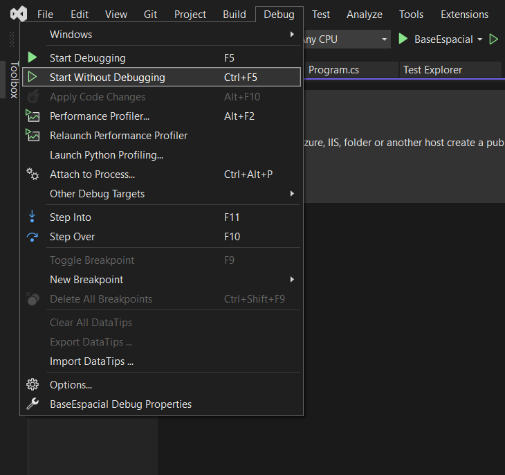
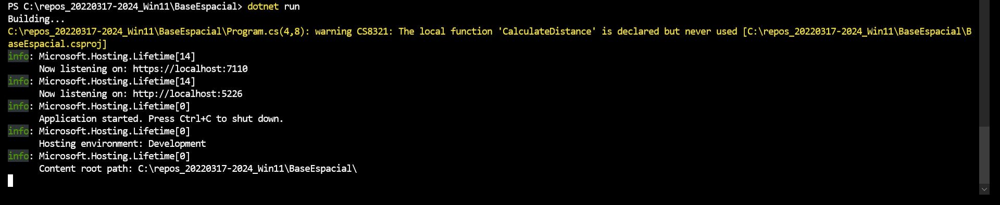
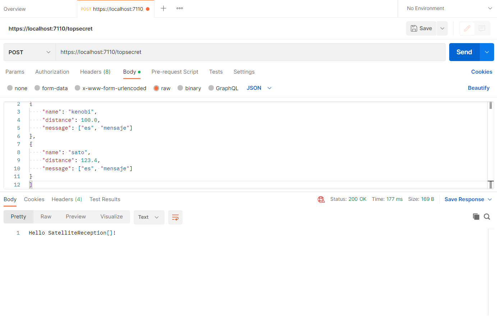
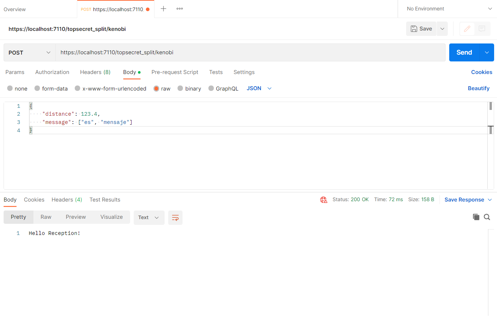

# BaseEspacialv1

Prueba técnica Base Espacial.

URL de código fuente: [https://github.com/da8y01/BaseEspacialv1](https://github.com/da8y01/BaseEspacialv1)

URL de alojamiento de aplicación: [https://baseespacialv1.azurewebsites.net/](https://baseespacialv1.azurewebsites.net/)

A pesar de que se tuvieron en cuenta el Teorema de Pitágoras, la distancia entre dos puntos, conceptos de triangulación geodésica, etc. para el cálculo de distancias y catetos (o componentes de ejes cartesianos), no se logró obtener el resultado esperado.

### Correr el programa
* Usando Visual Studio 2022, con el menú Debug opción Start Without Debugging, o con la combinación de teclas ctrl + f5 .



* Usando una terminal de comandos, estando en el directorio de la aplicación con el comando: `dotnet run`



### Ejemplos de requests a rutas de web application:

#### POST a ruta `/topsecret`:

Request:
```
[
{
    "name": "kenobi",
    "distance": 100.0,
    "message": ["es", "mensaje"]
},
{
    "distance": 123.4,
    "message": ["es", "mensaje"]
}
]
```

Response: `Hello SatelliteReception[]!`



#### POST a ruta `/topsecret_split/{satellite_name}`:

Request:
```
{
    "distance": 123.4,
    "message": ["es", "mensaje"]
}
```

Response: `Hello Reception!`



La aplicación está basada en el siguiente tutorial: [Tutorial: Create a minimal web API with ASP.NET Core](https://learn.microsoft.com/en-us/aspnet/core/tutorials/min-web-api?view=aspnetcore-6.0&tabs=visual-studio-code)

Para el despliegue se intentaron seguir las siguientes instrucciones: [Publish your web app](https://learn.microsoft.com/en-us/azure/app-service/quickstart-dotnetcore?tabs=net60&pivots=development-environment-vs#publish-your-web-app)
